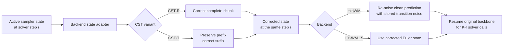

# ActionSplice

**Same-step state editing for interruptible world models.**

ActionSplice updates an active world-model rollout when the control input
changes before the current video chunk has finished sampling. Instead of
restarting the chunk or skipping solver steps, ActionSplice applies one learned
**Counterfactual State Transport (CST)** corrector at the current solver step
and lets the original backbone finish its normal denoising trajectory.

The current implementation targets
[minWM](https://github.com/shengshu-ai/minWM) and
[HY-WorldPlay / HY-WM1.5](https://github.com/Tencent-Hunyuan/HY-WorldPlay).

> [!IMPORTANT]
> This repository is in pre-release staging. Corrector weights are not
> public yet, and only the HY-WM1.5 CST-R inference path is wired end to end.
> The [implementation status](#implementation-status) below is authoritative.

## Contents

- [Method](#method)
- [Implementation status](#implementation-status)
- [Installation](#installation)
- [Training](#training)
- [Inference and model loading](#inference-and-model-loading)
- [Demo](#demo)
- [Repository structure](#repository-structure)
- [Development](#development)
- [Release roadmap](#release-roadmap)

## Method

ActionSplice provides two separately trained correctors:

| Variant | Edited region | Intended use |
|---|---|---|
| **CST-R** | Complete active chunk | Retarget a chunk after a control interruption |
| **CST-T** | Uncommitted suffix only | Preserve already committed frames while retargeting the remainder |

CST-T uses a hard temporal mask. The committed prefix is copied exactly; only
the suffix is corrected.



The runtime has no learned gate, adaptive fallback, horizon selection, or
solver-step jump. The upstream backbone remains unchanged.

### Backend state conventions

| Backend | Canonical state | Corrector target | Same-step reconstruction |
|---|---|---|---|
| minWM Wan Action2V | `[B,T,16,H,W]` | Clean prediction | Stored transition noise |
| HY-WM1.5 | `[B,32,T,H,W]` | Direct Euler state | None; deterministic resume |

See [docs/architecture.md](docs/architecture.md) for the implementation
boundary between CST and the upstream world models.

## Implementation status

Legend: ✅ available · 🟡 partial · ⛔ not yet wired

| Backend and variant | Data capture | Training | End-to-end inference |
|---|---:|---:|---:|
| minWM CST-R | 🟡 Bootstrap capture available; final recurrent migration pending | ✅ | ⛔ |
| minWM CST-T | ✅ Matched, prefix-clamped capture | ✅ | ⛔ |
| HY-WM1.5 CST-R | ✅ Bootstrap and recurrent paper capture | ✅ | ✅ `OfficialHYWorldPlayCSTHook` |
| HY-WM1.5 CST-T | ✅ Matched, prefix-clamped capture | ✅ | ⛔ |

All four training configurations can train from prepared captures. Exact
paper reproduction is not complete until recurrent on-policy minWM CST-R
capture is migrated. The three missing generation hooks are tracked in the
[release checklist](RELEASE_CHECKLIST.md).

## Installation

### Core and development tools

```bash
git clone https://github.com/PardisTaghavi/ActionSplice.git
cd ActionSplice

python -m venv .venv
source .venv/bin/activate
python -m pip install --upgrade pip
python -m pip install -e '.[dev]'
pytest
```

Optional dependencies are grouped by workflow:

```bash
python -m pip install -e '.[train]'
python -m pip install -e '.[demo]'
```

### Upstream backbones

ActionSplice integrates with upstream repositories rather than redistributing
their code or weights. Prepare the pinned revisions with:

```bash
bash scripts/prepare_backends.sh
```

> [!NOTE]
> minWM and HY-WorldPlay both install a top-level `hyvideo` package. Use a
> separate Python environment for each backend.

Pinned revisions and licensing notes are recorded in
[THIRD_PARTY.md](THIRD_PARTY.md).

## Training

Choose one backend-specific configuration:

| Backend | CST-R | CST-T |
|---|---|---|
| minWM | `configs/minwm/train_cst_r.json` | `configs/minwm/train_cst_t.json` |
| HY-WM1.5 | `configs/hyworld15/train_cst_r.json` | `configs/hyworld15/train_cst_t.json` |

Replace the `<PATH_TO_...>` values in a copied configuration, then train one
corrector:

```bash
actionsplice-train \
  --capture-dir /path/to/captures \
  --output-dir outputs/minwm-cst-r \
  --config configs/minwm/train_cst_r.json
```

Resume an interrupted run with `--resume /path/to/checkpoint.pt`.

The training code preserves the research objectives already used by the
project: normalized state reconstruction, the minWM clean-prediction delta,
suffix-masked CST-T reconstruction, the CST-T intra-chunk boundary term, and
optional decoded LPIPS/temporal/boundary terms. Repository cleanup did not
introduce new losses.

Capture commands, manifest formats, split checks, and backend-specific
examples are documented in [docs/training.md](docs/training.md).

## Inference and model loading

Corrector weights are **not public yet**. The repository contains no backbone
or corrector checkpoints. Placeholder Hugging Face IDs are kept in
`configs/models/models.example.json`, and `scripts/download_weights.sh` exits
until real repositories are configured.

**Checkpoints:** [PardisTaghavi/ActionSplice on Hugging Face](https://huggingface.co/PardisTaghavi/ActionSplice/tree/main)

The Hugging Face repository may remain access-controlled until the checkpoint
release is finalized.

Local corrector checkpoints can be loaded independently of the backbone:

```python
from pathlib import Path

import torch

from cst.core.runtime import load_transport_model

corrector, metadata = load_transport_model(
    Path("checkpoints/hyworld15-cst-r/best.pt"),
    device=torch.device("cuda"),
    dtype=torch.bfloat16,
)
```

The loader validates backend target type and checkpoint role. Load the
upstream backbone separately under its original license.

- [Inference sequence and current hooks](docs/inference.md)
- [Checkpoint validation and future HF loading](docs/model_loading.md)

## Demo

The lightweight Gradio demo uses precomputed videos, so it can run without
shipping world-model or corrector weights:

```bash
python -m pip install -e '.[demo]'
python demo/app.py
```

Add redistributable examples under `demo/examples/` and register them in
`demo/examples/manifest.json`. The same directory is structured to become a
Hugging Face Space.

## Repository structure

```text
ActionSplice/
├── src/cst/
│   ├── backends/       minWM/HY adapters and shared backend registry
│   ├── core/           corrector model, state layouts, same-step runtime
│   ├── data/           capture schemas, datasets, partitions, manifests
│   ├── training/       shared corrector training loop and losses
│   └── cli/            capture, manifest, training, and evaluation commands
├── configs/
│   ├── minwm/          minWM CST-R/CST-T capture and training configs
│   ├── hyworld15/      HY CST-R/CST-T capture and training configs
│   └── models/         unpublished-weight placeholders
├── demo/               precomputed-video Gradio/HF Space scaffold
├── docs/               architecture, training, inference, model loading
├── scripts/            upstream setup and future weight download helpers
└── tests/               CPU unit tests
```

The distribution is named `actionsplice`; the import package remains `cst`
because CST is the framework's core operation. `cst.backends` is the shared
backend boundary and keeps upstream imports lazy.

<details>
<summary>Checkpoint naming compatibility</summary>

Research checkpoints retain legacy role strings for strict validation:

| Public method | minWM role | HY-WM1.5 role |
|---|---|---|
| CST-R | `action_h0` | `action_h0_state` |
| CST-T | `action_hm` | `action_hm_state` |

Public commands, files, and documentation use CST-R/CST-T.

</details>

## Development

Run the CPU checks before committing:

```bash
ruff check .
pytest
```

Generated captures, checkpoints, outputs, upstream repositories, and W&B
artifacts are excluded by `.gitignore`. Do not commit private cluster paths,
unpublished model IDs, or third-party weights.

## Release roadmap

- Migrate recurrent on-policy minWM CST-R capture.
- Add minWM CST-R and CST-T generation hooks.
- Add the HY-WM1.5 CST-T on-policy suffix-mask hook.
- Run GPU integration tests against both pinned upstream revisions.
- Publish the four CST corrector checkpoints and model cards on Hugging Face.
- Populate and publish the precomputed Hugging Face Space.
- Add redistributable qualitative examples, paper citation, and final results.
- Complete provenance review and select the open-source license.

The detailed checklist lives in [RELEASE_CHECKLIST.md](RELEASE_CHECKLIST.md).

## Citation

The paper citation will be added when the public preprint is available.

## License

The project license is being finalized. A `LICENSE` file must be added before
the repository is made public.
